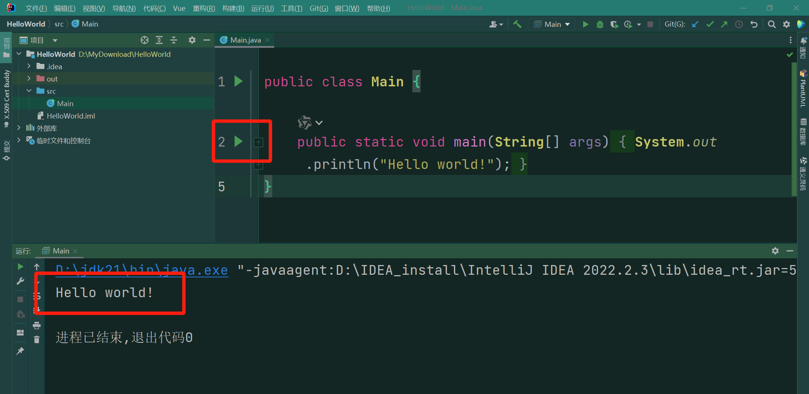
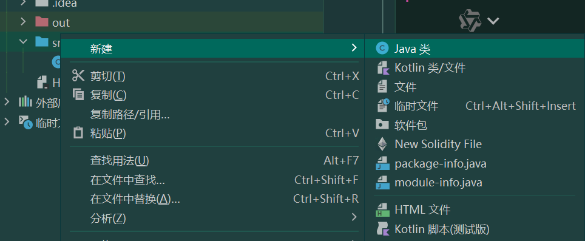

# 实验一

## 一、实验目的

- 熟悉 IntelliJ IDEA 和 WireShark 软件的使用
- 学习并掌握 Java 编程基础
- 学习并掌握 Java 多线程编程

## 二、实验任务

- 配置 Java 开发环境和 IntelliJ IDEA
- 安装 WireShark 软件
- 熟悉 Java 的变量、操作符、控制流程、数组、字符串、I/O、类和对象
- 熟悉 Java 的继承、多态、接口、抽象类、异常处理
- 熟悉 Java 多线程编程常用的方法

## 三、实验计划

| 实验时间 | 实验内容                                                     |
| -------- | ------------------------------------------------------------ |
| 第一周   | 学习 IntelliJ IDEA 和 WireShark 软件的使用                   |
| 第二周   | 学习 Java 的基础知识（变量、操作符...类和对象），理解相关示例代码 |
| 第三周   | 学习 Java 的基础知识（继承、多态...），线程创建的方法，理解相关示例代码 |
| 第四周   | 学习 Java 的多线程编程的常用方法，完成实验任务               |

##  四、实验过程

### 1.  配置 Java 开发环境

- Java IDE: IDEA下载安装 [https://www.jetbrains.com/idea/download](https://www.jetbrains.com/idea/download)
  - Ultimate 或 Community Edition 均可
  - 如下载Ultimate版，可注册 JB Account 账号，通过学生邮箱获取进行免费激活 [IntelliJ IDEA(Ultimate版)学生免费激活教程](https://segmentfault.com/a/1190000039175603)
  - 个性化配置教程 [https://cloud.tencent.com/developer/article/1843025](https://cloud.tencent.com/developer/article/1843025)
- 下载安装特定版本的 jdk (使用 JDK21)
  - 可在IDEA中下载安装 openjdk-21

### 2. 安装 Wireshark

- Wireshark 下载安装：https://www.wireshark.org/download.html

  

  

  

  

  

- 注意：安装过程中在额外安装 Npcap 时，一定要取消勾选下图所示选项。

  

  

- 打开Wireshark软件，选择你用的网卡（⼀般呈折线形变化）

  


- 双击选择的网卡之后，Wireshark会自动抓取通过该网卡的网络包

  


### 3. IDEA 运行示例代码

- 从下面网站了解 Java 的语法知识，学习以下知识点
  -  基本数据类型、操作符、控制流程
  - 数组、字符串、I/O、类和对象
  - 继承、多态、接口、抽象类
  - **网站链接**：https://www.runoob.com/java/java-tutorial.html

- IDEA 运行 Java 代码

  - 新建项目

  

  - 运行 Main 类，点击上面红框运行得到结果

  

  - 在 src 目录添加新的 Java 类

  

- 理解并运行示例代码

  - Lab1：Java 基本数据类型、操作符、控制流程

  ```java
  /**
   * Java 基础
   */
  public class Lab1 {
      public static void main(String[] args) {
          // 1. 基本数据类型
          int intVar = 10;       // 整型
          double doubleVar = 20.5; // 浮点型
          char charVar = 'A';    // 字符型
          boolean boolVar = true; // 布尔型
  
          // 2. 操作符示例
          int sum = intVar + 5;  // 加法运算
          int diff = intVar - 3; // 减法运算
          int product = intVar * 2; // 乘法运算
          int quotient = intVar / 2; // 除法运算
          int remainder = intVar % 3; // 取模运算
  
          // 3. 关系运算符
          boolean isGreater = intVar > 5; // 大于
          boolean isEqual = intVar == 10; // 等于
  
          // 4. 逻辑运算符
          boolean andResult = (intVar > 5) && (doubleVar < 30); // 逻辑与
          boolean orResult = (intVar > 15) || (doubleVar > 10); // 逻辑或
  
          // 5. 条件控制流程
          if (intVar > 5) {
              System.out.println("intVar大于5");
          } else {
              System.out.println("intVar不大于5");
          }
  
          // 6. switch 语句
          switch (charVar) {
              case 'A':
                  System.out.println("字符是A");
                  break;
              case 'B':
                  System.out.println("字符是B");
                  break;
              default:
                  System.out.println("字符不是A或B");
          }
  
          // 7. 循环控制
          // for循环
          for (int i = 0; i < 5; i++) {
              System.out.println("循环次数: " + i);
          }
  
          // while循环
          int count = 0;
          while (count < 3) {
              System.out.println("while循环: " + count);
              count++;
          }
  
          // do-while循环
          int num = 0;
          do {
              System.out.println("do-while循环: " + num);
              num++;
          } while (num < 3);
      }
  }
  ```
  **输出结果:**
  
  ```shell
  intVar大于5
  字符是A
  循环次数: 0
  循环次数: 1
  循环次数: 2
  循环次数: 3
  循环次数: 4
  while循环: 0
  while循环: 1
  while循环: 2
  do-while循环: 0
  do-while循环: 1
  do-while循环: 2
  ```
  
  - Lab2：Java 数组
  
  ```java
  import java.util.Arrays;
  
  /**
   * Java 数组
   */
  public class Lab1 {
      public static void main(String[] args) {
          // Java 数组
          // 1. 创建数组
          int[] numbers = {5, 2, 8, 1, 3};
          System.out.println("原始数组: " + Arrays.toString(numbers));
  
          // 2. 排序数组
          Arrays.sort(numbers);
          System.out.println("排序后: " + Arrays.toString(numbers));
  
          // 3. 查找元素（二分查找，需先排序）
          int index = Arrays.binarySearch(numbers, 3);
          System.out.println("元素 3 的索引: " + index);
  
          // 4. 填充数组
          int[] filledArray = new int[5];
          Arrays.fill(filledArray, 7);
          System.out.println("填充后的数组: " + Arrays.toString(filledArray));
  
          // 5. 复制数组
          int[] copiedArray = Arrays.copyOf(numbers, numbers.length);
          System.out.println("复制的数组: " + Arrays.toString(copiedArray));
  
          // 6. 遍历数组
          System.out.print("遍历数组: ");
          for (int num : numbers) {
              System.out.print(num + " ");
          }
          System.out.println();
  
          // 7. 修改数组元素
          numbers[2] = 10; // 修改索引 2 处的元素值
          System.out.println("修改后数组: " + Arrays.toString(numbers));
      }
  }
  ```
  
  **输出结果:**
  
  ```shell
  原始数组: [5, 2, 8, 1, 3]
  排序后: [1, 2, 3, 5, 8]
  元素 3 的索引: 2
  填充后的数组: [7, 7, 7, 7, 7]
  复制的数组: [1, 2, 3, 5, 8]
  遍历数组: 1 2 3 5 8 
  修改后数组: [1, 2, 10, 5, 8]
  ```
  
  - Lab3：Java 字符串
  
  ```java
  /**
   * Java 字符串
   */
  public class Lab1 {
      public static void main(String[] args) {
          // 1. 创建字符串
          String str = "Hello, Java!";
          System.out.println("原始字符串: " + str);
  
          // 2. 获取字符串长度
          System.out.println("字符串长度: " + str.length());
  
          // 3. 字符串拼接
          String str2 = " Welcome!";
          String concatenated = str.concat(str2);
          System.out.println("拼接后: " + concatenated);
  
          // 4. 查找子字符串
          int index = str.indexOf("Java");
          System.out.println("'Java' 的索引: " + index);
  
          // 5. 替换字符串
          String replacedStr = str.replace("Java", "World");
          System.out.println("替换后: " + replacedStr);
  
          // 6. 大小写转换
          System.out.println("大写: " + str.toUpperCase());
          System.out.println("小写: " + str.toLowerCase());
  
          // 7. 字符串拆分
          String[] words = str.split(", ");
          System.out.println("拆分后的单词:");
          for (String word : words) {
              System.out.println(word);
          }
  
          // 8. 去除首尾空格
          String spacedStr = "  Trim Me  ";
          System.out.println("去空格前: '" + spacedStr + "'");
          System.out.println("去空格后: '" + spacedStr.trim() + "'");
      }
  }
  ```
  
  **输出结果:**
  
  ```shell
  原始字符串: Hello, Java!
  字符串长度: 12
  拼接后: Hello, Java! Welcome!
  'Java' 的索引: 7
  替换后: Hello, World!
  大写: HELLO, JAVA!
  小写: hello, java!
  拆分后的单词:
  Hello
  Java!
  去空格前: '  Trim Me  '
  去空格后: 'Trim Me'
  ```
  
  - Lab4：Java I/O 类
  
  ```java
  import java.io.PrintWriter;
  import java.util.Scanner;
  
  public class Lab4 {
      public static void main(String[] args) {
          // 创建 Scanner 对象，从标准输入（键盘）读取用户输入
          Scanner sc = new Scanner(System.in);
  
          // 创建 PrintWriter 对象，输出到标准输出（控制台）
          PrintWriter pw = new PrintWriter(System.out);
  
          // 循环读取输入，直到输入结束
          while (sc.hasNext()) { // hasNext() 方法检查是否还有输入
              String line = sc.next(); // 读取一个单词（以空格或换行符分隔）
  
              // 1. 直接使用 System.out.println 输出到控制台
              System.out.println("收到输入的字符串为:" + line);
  
              // 2. 使用 PrintWriter 进行输出
              pw.println("收到输入的字符串为:" + line);
  
              // 强制刷新 PrintWriter 缓冲区，确保数据被立即输出
              pw.flush(); // 试试将此行注释掉，观察输出的变化
          }
  
          // 关闭 Scanner 对象
          sc.close();
      }
  }
  ```
  
  **输出结果:**
  
  ```shell
  ecnu
  收到输入的字符串为:ecnu
  收到输入的字符串为:ecnu
  华东师范大学
  收到输入的字符串为:华东师范大学
  收到输入的字符串为:华东师范大学
  dase
  收到输入的字符串为:dase
  收到输入的字符串为:dase
  ```
  
  - Lab5：Java 继承、接口、多态
  
  ```java
  // 定义动物接口，包含动物的基本行为
  interface AnimalActions {
      void eat(); // 吃东西
      void sleep(); // 睡觉
  }
  
  // 定义抽象动物类，实现 AnimalActions 接口
  public abstract class Animal implements AnimalActions {
      protected String name;
      protected int age;
  
      // 构造方法，初始化动物的名称和年龄
      public Animal(String name, int age) {
          this.name = name;
          this.age = age;
      }
  
      // 介绍动物的方法
      public void introduce() {
          System.out.printf("大家好！我是 %s，今年 %d 岁。\n", name, age);
      }
  
      // 抽象方法，要求子类必须实现
      public abstract void makeSound();
  }
  
  // 具体的动物类 - 企鹅
  class Penguin extends Animal {
      public Penguin(String name, int age) {
          super(name, age);
      }
  
      // 实现吃的方法
      @Override
      public void eat() {
          System.out.println(name + " 正在吃鱼");
      }
  
      // 实现睡觉的方法
      @Override
      public void sleep() {
          System.out.println(name + " 正在睡觉");
      }
  
      // 重写 makeSound 方法
      @Override
      public void makeSound() {
          System.out.println(name + " 发出了呱呱的叫声");
      }
  }
  
  // 具体的动物类 - 老鼠
  class Mouse extends Animal {
      public Mouse(String name, int age) {
          super(name, age);
      }
  
      // 实现吃的方法
      @Override
      public void eat() {
          System.out.println(name + " 正在吃奶酪");
      }
  
      // 实现睡觉的方法
      @Override
      public void sleep() {
          System.out.println(name + " 正在睡觉");
      }
  
      // 重写 makeSound 方法
      @Override
      public void makeSound() {
          System.out.println(name + " 发出了吱吱的叫声");
      }
  }
  
  ```
  
  ```java
  public class Lab5 {
      public static void main(String[] args) {
          Animal penguin = new Penguin("企鹅小白", 3);
          Animal mouse = new Mouse("小鼠米米", 1);
  
          penguin.introduce();
          penguin.eat();
          penguin.sleep();
          penguin.makeSound();
  
          System.out.println();
  
          mouse.introduce();
          mouse.eat();
          mouse.sleep();
          mouse.makeSound();
      }
  }
  ```
  
  **输出结果:**
  
  ```shell
  大家好！我是 企鹅小白，今年 3 岁。
  企鹅小白 正在吃鱼
  企鹅小白 正在睡觉
  企鹅小白 发出了呱呱的叫声
  
  大家好！我是 小鼠米米，今年 1 岁。
  小鼠米米 正在吃奶酪
  小鼠米米 正在睡觉
  小鼠米米 发出了吱吱的叫声
  ```
  
  - Lab6：Java 异常
  
  ```java
  public class Lab6 {
  
      public static void test1(){
          int[] scores = {85, 90, 78, 102, -5}; // 包含无效成绩
  
          try {
              // 1. 成绩超出 100，抛出 IllegalArgumentException 异常
              double average = calculateAverage(scores);
              System.out.println("平均成绩: " + average);
          } catch (ArithmeticException e) {
              System.err.println("数学计算错误: " + e.getMessage());
          } catch (ArrayIndexOutOfBoundsException e) {
              System.err.println("数组索引越界: " + e.getMessage());
          } catch (IllegalArgumentException e) {
              System.err.println("非法参数: " + e.getMessage());
          }
      }
  
      public static void test2(){
          int[] scores = {85, 90, 78, 102, -5}; // 包含无效成绩
          try {
              // 2. 访问越界位置，抛出 ArrayIndexOutOfBoundsException 异常
              int invalidScore = scores[scores.length]; // 触发异常
              System.out.println("无效成绩: " + invalidScore);
          } catch (ArithmeticException e) {
              System.err.println("数学计算错误: " + e.getMessage());
          } catch (ArrayIndexOutOfBoundsException e) {
              System.err.println("数组索引越界: " + e.getMessage());
          } catch (IllegalArgumentException e) {
              System.err.println("非法参数: " + e.getMessage());
          }
      }
  
      public static void test3(){
          try {
              // 3. 除零错误，抛出 ArithmeticException 异常
              int zero = 0;
              int result = 100 / zero; // 触发异常
              System.out.println("计算结果: " + result);
          } catch (ArithmeticException e) {
              System.err.println("数学计算错误: " + e.getMessage());
          } catch (ArrayIndexOutOfBoundsException e) {
              System.err.println("数组索引越界: " + e.getMessage());
          } catch (IllegalArgumentException e) {
              System.err.println("非法参数: " + e.getMessage());
          } 
      }
  
      public static void main(String[] args) {
          test1();
          test2();
          test3();
      }
  
      public static double calculateAverage(int[] scores) {
          if (scores == null || scores.length == 0) {
              throw new IllegalArgumentException("成绩列表不能为空");
          }
  
          int sum = 0;
          for (int score : scores) {
              if (score < 0 || score > 100) {
                  throw new IllegalArgumentException("无效的成绩: " + score);
              }
              sum += score;
          }
          return (double) sum / scores.length;
      }
  }
  
  ```
  
  **输出结果:**
  
  ```shell
  非法参数: 无效的成绩: 102
  数组索引越界: Index 5 out of bounds for length 5
  数学计算错误: / by zero
  ```
### 4. Java 多线程

#### 4.1 线程创建

##### 4.1.1 继承 Thread 类创建线程

通过继承 **Thread** 类来创建并启动多线程的一般步骤如下：

1. 定义 Thread 类的子类，并重写该类的 run() 方法，该方法的方法体就是线程需要完成的任务，即线程的执行体。

2. 创建 Thread 子类的实例，创建一个线程对象。

3. 调用线程的 start() 方法，启动线程。

示例代码如下所示：

```java
class ThreadTest01 extends Thread{

    @Override
    public void run() {
        System.out.println(Thread.currentThread().getName());
    }

    public static void main(String[] args){
        ThreadTest01 mthread1 = new ThreadTest01();
        ThreadTest01 mthread2 = new ThreadTest01();
        ThreadTest01 mthread3 = new ThreadTest01();

        mthread1.start();
        mthread2.start();
        mthread3.start();
    }
}
```

##### 4.1.2 实现Runnable接口创建线程

通过实现 **Runnable** 接口创建并启动线程一般步骤如下：

1. 定义 Runnable 接口的实现类，一样要重写 run() 方法，这个 run() 方法和 Thread 中的 run() 方法一样是线程的执行体。

2. 创建 Runnable 实现类的实例，并用这个实例作为 Thread 的 target 来创建 Thread 对象，这个 Thread 对象才是真正的线程对象。

3. 第三步依然是通过调用线程对象的 start() 方法来启动线程。

示例代码如下所示：

```java
public class ThreadTest02 implements Runnable{
    @Override
    public void run() {
        System.out.println(Thread.currentThread().getName());
    }

   public static void main(String[] args){
       ThreadTest02 tr = new ThreadTest02();
       Thread thread1 = new Thread(tr, "线程1");
       Thread thread2 = new Thread(tr, "线程2");
       Thread thread3 = new Thread(tr, "线程3");

       thread1.start();
       thread2.start();
       thread3.start();
   }
}
```

#### 4.2 线程控制

##### 4.2.1 线程 join()

线程 join 可以让一个线程等待另一个线程执行完毕以后再执行，例如，若在 A 线程中调用了 B 线程的 join 方法，只有当 B 线程执行完毕时，A 线程才能继续执行。

```java
//... 
public static void main(String[] args) throws InterruptedException {    
    ThreadTest01 thread1 = new ThreadTest01();
    thread1.start();
    thread1.join();
    //...
}
//...
```

1. 线程 join 的作用：主要作用是同步，它可以使得线程之间的并行执行变为串行执行.

2. join 和 start 调用顺序问题：join() 方法必须在线程 start() 方法调用之后调用才有意义。一个线程都还未开始运行，同步是不具有任何意义的。

```java
public class ThreadTest03 implements Runnable{
    @Override
    public void run(){
        System.out.println(Thread.currentThread().getName());
    }

    public static void main(String[] args) throws InterruptedException {
        ThreadTest03 join = new ThreadTest03();
        Thread thread1 = new Thread(join, "上课铃响");
        Thread thread2 = new Thread(join, "老师上课");
        Thread thread3 = new Thread(join, "下课铃响");
        Thread thread4 = new Thread(join, "老师下课");

        thread1.start();
        thread2.start();
        thread3.start();
        thread4.start();
    }
}
```

##### 4.2.2 守护线程

Java 中有一种线程只在后台运行，为其他线程提供服务，这种线程就是守护线程（Daemon Thread）。JRE 判断程序是否执行结束的标准是所有的前台线程（用户线程）执行完毕了，而不管后台线程（守护线程）的状态。

```java
public static void main(String[] args) {
    ThreadTest01 thread1 = new ThreadTest01();
    thread1.setDaemon(true); 
    thread1.start();
}
```

守护线程的作用是为其他线程提供便利服务，如负责线程调度的线程，守护线程最典型的应用就是 GC (垃圾回收器)。守护线程不应该去访问固有资源，如文件、数据库，因为不知在何时守护线程可能就结束了。

```java
public class ThreadTest04 implements Runnable{
    @Override
    public void run(){
        int worktime = 0;

        while(true){
            System.out.println("助教在教室的第"+ worktime +"秒");
            try{
                Thread.sleep(1000);
            }catch (InterruptedException e){
                e.printStackTrace();
            }
            worktime ++;
        }
    }

    public static void main(String[] args) throws InterruptedException{
        ThreadTest04 inClassroom = new ThreadTest04();
        Thread thread = new Thread(inClassroom,"助教");
        thread.start();
        for(int i = 0; i < 10; i++){
            Thread.sleep(1000);
            System.out.println("同学们正在上课");
            if(i == 9){
                System.out.println("同学们下课了");
            }
        }}
}
```

##### 4.2.3 线程优先级

线程的优先级用 1-10 之间的整数表示，数值越大优先级越高，默认的优先级为 5。线程的优先级仍然无法保障线程的执行次序。只不过，优先级高的线程获取 CPU 资源的概率较大，优先级低的并非没机会执行。

高优先级的线程比低优先级的线程有更高的几率得到执行，实际上这和操作系统及虚拟机版本相关，有可能即使设置了线程的优先级也不会产生任何作用。

```java
public class ThreadTest05 implements Runnable{
    @Override
    public void run(){
        for(int i = 1; i < 10; i++){
            System.out.println("线程"+ Thread.currentThread().getName() +"第 " + i + " 次执行！");
        }
    }
    public static void main(String[] args) throws InterruptedException{
        Thread t1 = new Thread(new ThreadTest05(), "线程1");
        Thread t2 = new Thread(new ThreadTest05(), "线程2");

        // 设置线程优先级
        t1.setPriority(10);
        t2.setPriority(1);

        t1.start();
        t2.start();
    }
}
```

##### 4.2.4 线程让步

线程让步是指**当前正在执行的线程**主动请求**让出 CPU 资源**，使调度器重新选择可运行的线程执行。

```java
class MyRunnable implements Runnable{
    @Override
    public void run(){
        for(int i = 1; i < 100; i++){
            //...
            Thread.yield();
        }}
}
```

yield() 方法会使**当前线程进入就绪状态**，让出 CPU 资源，并等待调度器重新分配执行权。调用 yield() 后，CPU 调度可能会选择运行**优先级等于或高于当前线程的其他可运行线程**，但不会强制发生线程切换，也不能保证让出的线程不会被再次立即调度执行。

```java
package thread;

class MyRunnable01 implements Runnable {
    @Override
    public void run() {
        for (int i = 1; i < 10; i++) {
            System.out.println("线程 " + Thread.currentThread().getName() + " 第 " + i + " 次执行！");
            Thread.yield(); // 让出 CPU
        }
    }
}

class MyRunnable02 implements Runnable {
    @Override
    public void run() {
        for (int i = 1; i < 10; i++) {
            System.out.println("线程 " + Thread.currentThread().getName() + " 第 " + i + " 次执行！");
            Thread.yield(); // 让出 CPU
        }
    }
}

public class ThreadTest06 {
    public static void main(String[] args) {
        Thread t1 = new Thread(new MyRunnable01(), "线程1");
        Thread t2 = new Thread(new MyRunnable02(), "线程2");

        // 设置线程优先级（测试优先级对 yield() 影响）
        t1.setPriority(Thread.MIN_PRIORITY); // 最低优先级
        t2.setPriority(Thread.MAX_PRIORITY); // 最高优先级

        t1.start();
        t2.start();
    }
}
```

> #### **4.3 线程同步**
>

在多线程编程的绝大多数情况下，如何来确保多个线程对**共享资源**的访问是**安全**、**有序**且**不会产生数据竞争或并发问题？**

##### 4.3.1 示例引入

* 假设现在有一个整型变量，值为 1000，有多个线程对该变量进行操作。其中一部分线程对变量进行加 1 操作，另外一部分线程对变量进行减 1 操作。

* 假设进行加 1 和减 1 的线程数目是一样的，且每次改变（加/减）的值都是 1 ，那么当所有线程执行结束后，变量的值还一定是 1000 吗？

##### 4.3.2 代码验证

* 编写PlusMinus基础类

```java
public class PlusMinus {
    public volatile int num;

    public void plusOne() {
        num = num + 1;
    }

    public void minusOne() {
        num = num - 1;
    }

    public int printNum() {
        return num;
    }
}
```

* 编写TestPlusMinus01测试类

```java
public class TestPlusMinus01 {
    public static void main(String[] args) {
        PlusMinus plusMinus = new PlusMinus();
        plusMinus.num = 1000; // 初始值设置为1000
        int threadNum = 1000; // 线程数目设置为1000

        Thread[] plusThreads = new Thread[threadNum];
        Thread[] minusThreads = new Thread[threadNum];

        for (int i = 0; i < threadNum; i++) {
            /* Java匿名类写法，实现临时创建一个新的类对象，且不需要定义类名 */
            Thread thread1 = new Thread() {
                @Override
                public void run() {
                    try {
                        sleep(1000);
                    } catch (InterruptedException e) {
                        e.printStackTrace();
                    }
                    plusMinus.plusOne();
                }
            };

            Thread thread2 = new Thread() {
                @Override
                public void run() {
                    try {
                        sleep(1000);
                    } catch (InterruptedException e) {
                        e.printStackTrace();
                    }
                    plusMinus.minusOne();
                }
            };
            thread1.start();
            thread2.start();
            plusThreads[i] = thread1;
            minusThreads[i] = thread2;
        }

        for (Thread thread : plusThreads) { // 等待所有加一线程结束
            try {
                thread.join();
            } catch (InterruptedException e) { // 等待所有减一线程结束
                e.printStackTrace();
            }
        }

        for (Thread thread : minusThreads) {
            try {
                thread.join();
            } catch (InterruptedException e) {
                e.printStackTrace();
            }
        }
        System.out.println("所有线程结束后的num值为：" + plusMinus.printNum());
    }
}
```

##### 4.3.3 原因分析

```shell
1. 负责加 1 的线程先运行，此时它得到的 num 值为 1000。
2. 负责加 1 的线程做加法运算。
3. 正在做加法运算的时候，还没来得及修改 num 的值，负责减法的线程开始执行了。
4. 负责减法的线程得到的 num 值也是 1000。
5. 负责减法的线程进行减法运算。
6. 负责加法的线程运算结束，得到num值为 1001，并把这个值赋值给 num。
7. 负责减法的线程运算结束，得到num值为 999，并把这个值赋值给 num。
8. num 最后的值为 999。
```

##### 4.3.4 解决办法

在线程访问 num 期间，其他线程不可以访问 num 。

```shell
1. 加法线程获取 num 的值，并进行运算。
2. 在运算期间，如果减法线程试图获取 num 的值，不被允许。
3. 加法运算结束，成功修改 num 值为 1001。
4. 减法线程在加法线程全部执行完成后，读取 num 值，为 1001。
5. 执行减法运算，得到新的 num 值为 1000。
```

##### 4.3.5 synchronized 关键字

synchronized 表示当前线程单独占有对象 object1 (即锁对象，锁对象可以是任意对象)，如果有其他线程也试图占有 object1，就会等待，直到当前线程释放对object1的占用。

```java
Object object1 = new Object();
    synchronized (object1){
	// 此处的代码只有线程占用了object1之后才可以运行
}
```

当一个线程访问某个对象的一个 synchronized(this) 同步代码块时，另一个线程仍然可以访问该对象中的非synchronized(this) 同步代码块。

synchronized 同样也可以修饰整个函数，就是在方法的前面加 synchronized。

```java
public synchronized void functionName(){
    // 需要被同步的代码块
}
```

编写 TestPlusMinus02 测试类，用 synchronized 来解决之前的问题。也可以将 PlusMinus 中的方法加上 synchronized，也可以解决。

```java
public class TestPlusMinus02 {
    // 锁对象
    private static final Object lock = new Object();

    public static void main(String[] args) {
        PlusMinus plusMinus = new PlusMinus();
        plusMinus.num = 1000; // 初始值设置为1000
        int threadNum = 1000; // 线程数目设置为1000

        Thread[] plusThreads = new Thread[threadNum];
        Thread[] minusThreads = new Thread[threadNum];

        for (int i = 0; i < threadNum; i++) {
            /* Java匿名类写法，实现临时创建一个新的类对象，且不需要定义类名 */
            Thread thread1 = new Thread(() -> {
                try {
                    Thread.sleep(1000);
                } catch (InterruptedException e) {
                    e.printStackTrace();
                }

                // 当前线程占有 lock 后才能执行加一操作
                try {
                    synchronized (lock) {
                        plusMinus.plusOne();
                    }
                } catch (Exception e) {
                    e.printStackTrace();
                }

            });

            Thread thread2 = new Thread(() -> {
                try {
                    Thread.sleep(1000);
                } catch (InterruptedException e) {
                    e.printStackTrace();
                }
                // 当前线程占有 lock 后才能执行减一操作
                try {
                    synchronized (lock) {
                        plusMinus.minusOne();
                    }
                } catch (Exception e) {
                    e.printStackTrace();
                }
            });
            thread1.start();
            thread2.start();
            plusThreads[i] = thread1;
            minusThreads[i] = thread2;
        }

        for (Thread thread : plusThreads) { // 等待所有加一线程结束
            try {
                thread.join();
            } catch (InterruptedException e) { // 等待所有减一线程结束
                e.printStackTrace();
            }
        }

        for (Thread thread : minusThreads) {
            try {
                thread.join();
            } catch (InterruptedException e) {
                e.printStackTrace();
            }
        }
        System.out.println("所有线程结束后的num值为：" + plusMinus.printNum());
    }
}
```

##### 4.3.6 线程死锁

* 死锁是由于程序员代码设计的问题导致的一类问题。
* Java 中通过 synchronized 解决同步问题时，若发生死锁，没有办法自动解锁。

##### 4.3.7 代码验证

* 编写 DeadLock 测试类

```java
public class DeadLock {

    public static void main(String[] args){
        PlusMinus plusMinus1 = new PlusMinus();
        plusMinus1.num = 1000;

        PlusMinus plusMinus2 = new PlusMinus();
        plusMinus2.num = 1000;

        Thread thread1 = new Thread(() -> {
            synchronized (plusMinus1){
                System.out.println("thread1 正在占用 plusMinus1");

                try {
                    Thread.sleep(1000);
                } catch (InterruptedException e) {
                    e.printStackTrace();
                }

                System.out.println("thread1 试图继续占用 plusMinus2");
                System.out.println("thread1 等待中...");
                synchronized (plusMinus2){
                    System.out.println("thread1 成功占用了 plusMinus2 ");
                }}});

        thread1.start();
        Thread thread2 = new Thread(() -> {
            synchronized (plusMinus2){
                System.out.println("thread2 正在占用 plusMinus2");

                try {
                    Thread.sleep(1000);
                } catch (InterruptedException e) {
                    e.printStackTrace();
                }

                System.out.println("thread2 试图继续占用 plusMinus1");
                synchronized (plusMinus1){
                    System.out.println("thread1 成功占用了 plusMinus1 ");
                }}});
        thread2.start();
    }
}
```

#### 4.4 线程交互

##### 4.4.1 示例引入

* 在多线程场景中，线程之间可能涉及交互。
* 例如对于一个 int 变量，有两个线程对它操作，一个每次加 1，一个每次减 1。对于减 1 的线程，如果它发现变量值此时为 1 就停止它的操作，直到变量值大于 1 才继续减。
* 修改 PlusMinus 基础类：

```java
public class PlusMinusSynchronized {
    public volatile int num;

    public void plusOne(){
        synchronized (this){
            this.num = this.num + 1;
            printNum();
        }}

    public void minusOne() {
        synchronized (this) {
            this.num = this.num - 1;
            printNum();
        }}

    public void printNum(){
        System.out.println("num = " + this.num);
    }
}
```
- 编写 TestPlusMinusSynchronized 类，测试线程交互

```java
public class TestPlusMinusSynchronized {

    public static void main(String[] args) {
        PlusMinusSynchronized plusMinus = new PlusMinusSynchronized();
        plusMinus.num = 100;

        Thread thread1 = new Thread(() -> {
            while (true) {
                if (plusMinus.num == 1) {
                    continue;
                }

                plusMinus.minusOne();

                try {
                    Thread.sleep(10);
                } catch (InterruptedException e) {
                    e.printStackTrace();
                }
            }
        });
        thread1.start();

        Thread thread2 = new Thread(() -> {
            while (true) {
                plusMinus.plusOne();

                try {
                    Thread.sleep(100);
                } catch (InterruptedException e) {
                    e.printStackTrace();
                }
            }
        });
        thread2.start();
    }
}
```


##### 4.4.2 使用 wait 和 notify

* 运行 **4.4.1** 的代码可以发现，线程大量占用 CPU 导致整体性能下降。
* wait 和 notify 都是 Object 的方法。
* wait：让占用了这个同步对象的线程临时释放占用的资源，回到就绪状态等待。wait 的调用应该在synchronized 代码里，表示已经获取了相关资源。
* notify：唤醒一个等待占用同步对象的线程。

利用 wait 和 notify 优化线程交互，避免线程大量占用。

- 编写 PlusMinusImproved 类

```java
public class PlusMinusImproved {
    public volatile int num;

    public synchronized void plusOne() {
        num++;
        System.out.println("Plus: " + num);
        notify(); // 通知等待的线程
    }

    public synchronized void minusOne() {
        while (num <= 1) {
            try {
                wait(); // 如果 num <= 1，进入等待状态
            } catch (InterruptedException e) {
                e.printStackTrace();
            }
        }
        num--;
        System.out.println("Minus: " + num);
        notify(); // 通知等待的线程
    }
}
```

- 编写 TestPlusMinusImproved 类

```java
public class TestPlusMinusImproved {

    public static void main(String[] args) {
        PlusMinusImproved plusMinus = new PlusMinusImproved();
        plusMinus.num = 100;

        Thread thread1 = new Thread(() -> {
            while (true) {
                plusMinus.minusOne();

                try {
                    Thread.sleep(10);
                } catch (InterruptedException e) {
                    e.printStackTrace();
                }
            }
        });
        thread1.start();

        Thread thread2 = new Thread(() -> {
            while (true) {
                plusMinus.plusOne();

                try {
                    Thread.sleep(100);
                } catch (InterruptedException e) {
                    e.printStackTrace();
                }
            }
        });
        thread2.start();
    }
}
```

## 五、实验报告

### 任务一

编写一个多线程程序，采用创建线程的两种方式，创建两个线程，一个线程负责打印字母，一个线程负责打印数字，要求最终打印出来的结果的为 **a1b23c456d7891e23456**，将关键代码和实现思路写入报告中。

### 任务二

编写一个多线程程序，模拟车站三个售票窗口同时进行售票、退票和新进票的操作，将关键代码和实现思路写入报告中。具体要求如下：

1. **售票**：
   - 每个窗口可以同时出售车票。
   - 购票时可能存在购买多张车票的情况。
   - 如果余票充足，则必须出售车票。
   - 如果余票不足，购票者可以选择：
     - 继续等待，直到有足够的车票。
     - 直接离开。
2. **退票**：
   - 每个窗口可以同时处理退票。
   - 退票时可能存在退多张车票的情况。
   - 退票成功后，余票数量增加。
3. **新进票**：
   - 车站会定期新进一定数量的车票。
   - 新进票后，如果有购票者在等待，应通知他们。
4. **同步要求**：
   - 多个窗口同时操作车票时，需要保证线程安全。
   - 购票时若无足量余票，购票者应进入等待状态，直到有新票进入或被其他购票者释放资源。
   - 退票和新进票操作应通知等待的购票者。
5. **输出要求**：
   - 每次售票、退票或新进票时，输出操作详情（如：窗口编号、操作类型、票数、余票数量等）。
   - 输出参考格式如下，不限定。
   
   ```shell
   初始所有窗口票数为: 20
   窗口 3 售出 5 张票，余票: 15
   窗口 1 售出 5 张票，余票: 10
   窗口 2 退票 1 张，余票: 11
   窗口 1 售出 5 张票，余票: 6
   窗口 2 售出 4 张票，余票: 2
   窗口 3 退票 1 张，余票: 3
   窗口 3 售出 3 张票，余票: 0
   窗口 2 余票不足，购票者等待...
   窗口 1 退票 1 张，余票: 1
   窗口 2 售出 1 张票，余票: 0
   窗口 3 退票 3 张，余票: 3
   窗口 1 售出 2 张票，余票: 1
   窗口 2 余票不足，购票者等待...
   窗口 1 余票不足，购票者等待...
   窗口 3 余票不足，购票者等待...
   新进票 10 张，余票: 11
   窗口 2 售出 4 张票，余票: 7
   窗口 1 售出 4 张票，余票: 3
   ```
   
   - 输出解释
   
   ```shell
   输出第 1 行: 初始化所有窗口的票数总和为 20 张票。
   输出第 2 行: 顾客在窗口 3 购买 5 张票，总票数剩余 15 张。（注：购票的窗口编号和数量可以用随机数模拟）
   输出第 3 行: 顾客在窗口 1 购买 5 张票，总票数剩余 10 张。
   输出第 4 行: 顾客在窗口 2 退了 1 张票，总票数剩余 11 张。（注：退票的窗口编号和数量可以用随机数模拟）
   ...
   输出第 9 行：顾客想在窗口 2 购票，但是总票数为 0，陷入等待状态。
   ...
   输出第 17 行: 车站新进票 10 张，总票数剩余 11 张，可以通知购票的顾客进行购票。（注：购票的顾客和退票的顾客可以用两个线程来模拟）
   ```
