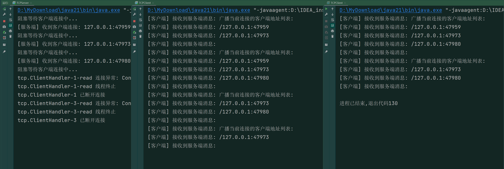

# 实验三 Socket 编程

## 一、实验目的

- 学习基于 TCP、UDP 的 Socket 编程
- 熟悉阻塞 I/O 与非阻塞I/O

## 二、实验任务

- 基于 TCP 的 Socket 编程
- Socket 编程优化
- 基于 UDP 的 Socket 编程
- EasyChat 简易聊天程序实现

## 三、实验计划

| 实验时间 | 实验内容                        |
| -------- | ------------------------------- |
| 第一周   | 完成基于 TCP 的 Socket 编程实验 |
| 第二周   | 完成 Socket 编程优化实验        |
| 第三周   | 完成基于 UDP 的 Socket 编程实验 |
| 第四周   | 完成 EasyChat，撰写实验报告     |

## 四、实验过程

### 预备知识

#### 1. Socket

Socket (套接字)常被用来指操作系统提供的允许你通过 TCP/IP 协议栈进行一整套建立连接，发送数据，断开连接的过程的接口，不同的操作系统封装的 socket 接口函数可能有所不同。

#### 2. ServerSocket 和 Socket 交互过程


##### 服务器端

* 创建 ServerSocket 对象，绑定监听端口
* 通过 accept() 方法监听客户端请求
* 连接建立后，通过输入流读取客户端发送的请求信息
* 通过输出流向客户端发送响应信息
* 关闭相关资源

##### 客户端

* 创建 Socket 对象，指明需要连接的服务器的地址和端口号
* 连接建立后，通过输出流向服务器发送请求信息
* 通过输入流获取服务器响应的信息
* 关闭相关资源

##### Socket 输入输出流的关系

服务器端：当客户端连接到服务器时，accept() 方法会返回一个**新的 Socket 对象**。这个 Socket 对象代表服务器端与该客户端之间的连接。通过这个 Socket，服务器可以读取客户端发送的数据，并向客户端发送数据。

客户端：通过**创建的 Socket 对象**与服务器端通信，读取服务器端发送的数据，并向服务器端发送数据。


#### 3. UDP

* UDP（user datagram protocol）的中文叫用户数据报协议，属于传输层。UDP 协议提供的服务不同于 TCP 协议的端到端服务，它是面向非连接的，属于不可靠的协议，UDP 套接字在使用前不需要进行连接，而使得通信效率更高。

* DatagramSocket，用于接收和发送 UDP 数据包的类，负责发送或者接收 UDP 数据包

```java
DatagramSocket(int port)  // 创建DatagramSocket实例(指定端口)
DatagramSocket(int port，InetAddress Addr) // 创建固定端⼝和ip的实例
receive(DatagramPacket d) // 接收DatagramPacket数据包
send(DatagramPacket d)    // 发送DatagramPacket数据包
setSoTimeout(int timeout) // 设置超时，毫秒为单位
```

- DatagramPacket，用于处理 UDP 数据包的类，将字节数组、目标地址、目标端口打包成 UDP 报文，或者解析 UDP 报文

```java
DatagramPacket(byte[] buf, int offset, int len, InetAddress Addr, int port) // offset和len指定了buffer数组的可用区间
setData(byte[] buf, int offset, int len)、getData()
setLength(int len)、getLength()
setPort(int port)、getPort()
setAddress(InetAddress address)、getAddress()
setSocketAddress(SocketAddress address)、getSocketAddress()
```

#### DatagramSocket 交互过程

**UDP不分服务器端和客户端，为了更好地表示，这里采用发送者和接收者的说法**


接收者端：

* 创建DatagramSocket，绑定端口号
* 创建DatagramPacket，用于接收UDP包
* 调用DatagramSocket的receive方法，接收发送者发送的UDP包
* 关闭套接字

发送者端：

* 创建DatagramSocket，绑定端口号
* 创建DatagramPacket，建立要发送的数据包，包含将要发送的信息
* 调用DatagramSocket的send方法，发送UDP数据包
* 关闭套接字

### 基于 TCP 的 Socket 编程

#### 单服务器端—单客户端

服务器端

```java
public class TCPServer01 {
    private ServerSocket serverSocket;
    private Socket clientSocket;
    private PrintWriter out;
    private BufferedReader in;

    public void start(int port) throws IOException {
        // 1. 创建一个服务器端Socket，即ServerSocket，监听指定端口
        serverSocket = new ServerSocket(port);
        // 2. 调用accept()方法开始监听，阻塞等待客户端的连接
        System.out.println("阻塞等待客户端连接中...");
        clientSocket = serverSocket.accept();
        // 3. 获取Socket的字节输出流
        out = new PrintWriter(new OutputStreamWriter(clientSocket.getOutputStream(), StandardCharsets.UTF_8), true);
        // 4. 获取Socket的字节输入流，并准备读取客户端发送的信息
        in = new BufferedReader(new InputStreamReader(clientSocket.getInputStream(), StandardCharsets.UTF_8));
        // 5. 阻塞读取客户端发送的信息
        String str = in.readLine();
        System.out.println("我是服务端，客户端说： " + str);
        // 消息回写
        out.println("服务端已收到消息" + str);
    }

    public void stop(){
        // 关闭相关资源
        try {
            if(in!=null) in.close();
            if(out!=null) out.close();
            if(clientSocket!=null) clientSocket.close();
            if(serverSocket!=null) serverSocket.close();
        }catch (IOException e){
            e.printStackTrace();
        }
    }

    public static void main(String[] args) {
        int port = 9091;
        TCPServer01 server=new TCPServer01();
        try {
            server.start(port);
        }catch (IOException e){
            e.printStackTrace();
        }finally {
            server.stop();
        }
    }
}
```

客户端

```java
public class TCPClient01 {
    private Socket clientSocket;
    private PrintWriter out;
    private BufferedReader in;

    public void startConnection(String ip, int port) throws IOException {
        // 1. 创建客户端Socket，指定服务器地址，端口
        clientSocket = new Socket(ip, port);
        // 2. 获取输入输出流
        out = new PrintWriter(new OutputStreamWriter(clientSocket.getOutputStream(), StandardCharsets.UTF_8), true);
        in = new BufferedReader(new InputStreamReader(clientSocket.getInputStream(), StandardCharsets.UTF_8));
    }

    public String sendMessage(String msg) throws IOException {
        // 3. 向服务端发送消息
        out.println(msg);
        // 4. 接收服务端回写信息
        String resp = in.readLine();
        return resp;
    }

    public void stopConnection() {
        // 关闭相关资源
        try {
            if(in!=null) in.close();
            if(out!=null) out.close();
            if(clientSocket!=null) clientSocket.close();
        } catch (IOException e){
            e.printStackTrace();
        }
    }

    public static void main(String[] args) {
        int port = 9091;
        TCPClient01 client = new TCPClient01();
        try {
            client.startConnection("127.0.0.1", port);
            String response = client.sendMessage("用户名: ECNUDaSE;");
            System.out.println(response);
        }catch (IOException e){
            e.printStackTrace();
        }finally {
            client.stopConnection();
        }
    }
}
```

实现效果（注意：**先启动服务端**）

```
服务端：
阻塞等待客户端连接中...
我是服务端，客户端说： 用户名: ECNUDaSE;

客户端：
服务端已收到消息用户名: ECNUDaSE;
```


修改 TCPServer 和 TCPClient 的代码，加入以下代码段，让客户端可以发送多次消息并且服务端可以循环读取。

服务器端：

```java
public void start(int port) throws IOException {
    // 1. 创建一个服务器端Socket，即ServerSocket，监听指定端口
    serverSocket = new ServerSocket(port);
    // 2. 调用accept()方法开始监听，阻塞等待客户端的连接
    System.out.println("阻塞等待客户端连接中...");
    clientSocket = serverSocket.accept();
    // 3. 获取Socket的字节输出流
    out = new PrintWriter(new OutputStreamWriter(clientSocket.getOutputStream(), StandardCharsets.UTF_8), true);
    // 4. 获取Socket的字节输入流，并准备读取客户端发送的信息
    in = new BufferedReader(new InputStreamReader(clientSocket.getInputStream(), StandardCharsets.UTF_8));
    // 5. 阻塞读取客户端发送的信息
    String str;
    while ((str = in.readLine()) != null) {
        System.out.println("[服务端] 接受到客户端消息: " + str);
        // 消息回写
        out.println(str);
    }
}
```

客户端：

```java
public void sendMessage() {
        Scanner scanner = new Scanner(System.in);
        String msg = "waiting";
        while (!"exit".equals(msg)) {
            try {
                msg = scanner.nextLine();
                String resp = sendMessage(msg);
                System.out.println("[客户端] 接收到服务端消息: " + resp);
            } catch (IOException e) {
                e.printStackTrace();
            }
        }
    }
```

实现效果：

```shell
服务端：
阻塞等待客户端连接中...
[服务端] 接受到客户端消息: ecnu
[服务端] 接受到客户端消息: helloe
[服务端] 接受到客户端消息: exit

客户端：
ecnu
[客户端] 接收到服务端消息: ecnu
helloe
[客户端] 接收到服务端消息: helloe
exit
[客户端] 接收到服务端消息: exit
```

**<font color=#FF00>Task1:</font>  修改TCPClient类，达成如下效果：**

任务要求：

```shell
客户端不断读取用户控制台输入的一行英文字母串并将数据发送给服务器
服务器将收到的字符全部转换为小写字母，服务器将修改后的数据发送给客户端
客户端收到修改后的数据，并在其屏幕上显示
```

实现效果：

```shell
服务器端：
阻塞等待客户端连接中...
[服务端] 接受到客户端消息: Hello ECNU
[服务端] 接受到客户端消息: ECNU
[服务端] 接受到客户端消息: Hello World
[服务端] 接受到客户端消息: Exit
[服务端] 接受到客户端消息: exit

客户端：
Hello ECNU
[客户端] 接收到服务端消息: hello ecnu
ECNU
[客户端] 接收到服务端消息: ecnu
Hello World
[客户端] 接收到服务端消息: hello world
Exit
[客户端] 接收到服务端消息: exit
exit
[客户端] 接收到服务端消息: exit
```

#### 单服务器端—多客户端

服务器端：

```java
public class TCPServer03 {
    private ServerSocket serverSocket;

    public void start(int port) throws IOException {
        // 1. 创建一个服务器端Socket，即ServerSocket，监听指定端口
        serverSocket = new ServerSocket(port);
        int cnt = 1;
        // 2. 调用accept()方法开始监听，阻塞等待客户端的连接
        for (; ; ) {
            System.out.println("阻塞等待客户端连接中...");
            // 3. 处理客户端连接，创建Socket对象，并获取Socket相关联的输入输出流
            Socket clientSocket = serverSocket.accept();
            System.out.println("[服务端] 收到客户端连接: " + clientSocket.getInetAddress().getHostAddress() + ":" + clientSocket.getPort() + " 创建 tcp.ClientHandler-" + cnt + " 线程处理");

            new Thread(new ClientHandler(clientSocket, "tcp.ClientHandler-" + cnt++)).start();
        }

    }

    public void stop() {
        // 关闭相关资源
        try {
            if (serverSocket != null) serverSocket.close();
        } catch (IOException e) {
            e.printStackTrace();
        }
    }

    public static void main(String[] args) {
        int port = 9091;
        TCPServer03 server = new TCPServer03();
        try {
            server.start(port);
        } catch (IOException e) {
            e.printStackTrace();
        } finally {
            server.stop();
        }
    }
}


class ClientHandler extends Thread {
    private Socket socket;

    ClientHandler(Socket socket, String name) {
        this.socket = socket;
        this.setName(name);
    }

    @Override
    public void run() {
        try {
            // 获取Socket相关联的输入输出流
            PrintWriter out = new PrintWriter(new OutputStreamWriter(socket.getOutputStream(), StandardCharsets.UTF_8), true);
            BufferedReader in = new BufferedReader(new InputStreamReader(socket.getInputStream(), StandardCharsets.UTF_8));

            // 读取并回写客户端发送过来的消息
            String str;
            while ((str = in.readLine()) != null) {
                System.out.println("[" + getName() + "] 接受到客户端消息: " + str);
                // 消息回写
                out.println(str);
            }

            out.close();
            in.close();
            if (socket != null) socket.close();
        } catch (IOException e) {
            throw new RuntimeException(e);
        }
    }
}
```

客户端：

沿用之前的 **TCPClient2.java**

注：如果要运行多个客户端，需要进行配置。

1. 编辑配置


2. 选择 “允许多个实例”


实现效果：


**<font color=#FF00>Task2:</font> 修改代码使得服务器端每一次 accept() 的 Socket 都被一个线程接管，同时接管的逻辑保留 Task1 的功能，开启一个服务端和三个客户端进行测试。**

实现效果：


#### TCP 半包粘包

* TCP协议是基于字节流的，本质上不存在半包粘包问题
* TCP的发送方一定会确保数据有序的到达接收方
* 所谓的半包粘包是应用层遇到的问题


提供如下TCPServer类和TCPClient类：

服务器端：

```java
import java.io.*;
import java.net.ServerSocket;
import java.net.Socket;
import java.nio.charset.StandardCharsets;

public class TCPServer {
    private ServerSocket serverSocket;
    private Socket clientSocket;
    private static int BYTE_LENGTH = 64;

    public void start(int port) throws IOException {
        serverSocket = new ServerSocket(port);
        System.out.println("阻塞等待客户端连接中...");
        clientSocket = serverSocket.accept();

        InputStream is = clientSocket.getInputStream();
        for(;;) {
            byte[] bytes = new byte[BYTE_LENGTH];
            // 读取客户端发送的信息
            int cnt = is.read(bytes, 0, BYTE_LENGTH);
            if(cnt>0)
            System.out.println("服务端已收到消息: " + new String(bytes).trim());
        }
    }

    public void stop(){
        // 关闭相关资源
        try {
            if(clientSocket!=null) clientSocket.close();
            if(serverSocket!=null) serverSocket.close();
        }catch (IOException e){
            e.printStackTrace();
        }
    }

    public static void main(String[] args) {
        int port = 9091;
        TCPServer server=new TCPServer();
        try {
            server.start(port);
        }catch (IOException e){
            e.printStackTrace();
        }finally {
            server.stop();
        }
    }
}
```

客户端：

```java
import java.io.*;
import java.net.Socket;

public class TCPClient {
    private Socket clientSocket;
    private OutputStream out;

    public void startConnection(String ip, int port) throws IOException {
        clientSocket = new Socket(ip, port);
        out = clientSocket.getOutputStream();
    }

    public void sendMessage(String msg) throws IOException {
        // 重复发送十次
        for(int i=0;i<10;i++){
            out.write(msg.getBytes());
        }
    }

    public void stopConnection() {
        // 关闭相关资源
        try {
            if(out!=null) out.close();
            if(clientSocket!=null) clientSocket.close();
        } catch (IOException e){
            e.printStackTrace();
        }
    }

    public static void main(String[] args) {
        int port = 9091;
        TCPClient client = new TCPClient();
        try {
            client.startConnection("127.0.0.1", port);
            String message = "NETWORK PRINCIPLE";
            client.sendMessage(message);
        }catch (IOException e){
            e.printStackTrace();
        }finally {
            client.stopConnection();
        }
    }
}
```

**<font color=#FF00>Task3:</font> 查阅资料，总结半包粘包产生的原因以及相关解决方案，尝试解决以上代码产生的半包粘包问题。**


### Socket 编程优化

#### 完善数据发送与接收并行

在上一节的实验中，仅能支持客户端发送一行数据然后服务器端回写一行数据，功能有限。本节将尝试将**数据发送与接收并行**，客户端和服务器端可任意地发送和接收数据。

- 增加 **ClientReadHandler** 类，用于处理从客户端读数据

```java
class ClientReadHandler extends Thread {
    private final BufferedReader bufferedReader;

    ClientReadHandler(InputStream inputStream) {
        this.bufferedReader = new BufferedReader(new InputStreamReader(inputStream, StandardCharsets.UTF_8));
    }

    @Override
    public void run() {
        try {
            while (true) {
                // 拿到客户端一条数据
                String str = bufferedReader.readLine();
                if (str == null) {
                    System.out.println("读到的数据为空");
                    break;
                } else {
                    System.out.println("读到的数据为：" + str);
                }
            }
        } catch (IOException e) {
            e.printStackTrace();
        }
    }
}
```

- 增加 **ClientWriteHandler** 类，用于处理向客户端写数据

```java
class ClientWriteHandler extends Thread {
    private final PrintWriter printWriter;
    private final Scanner sc;

    ClientWriteHandler(OutputStream outputStream) {
        this.printWriter = new PrintWriter(new OutputStreamWriter(outputStream, StandardCharsets.UTF_8), true);
        this.sc = new Scanner(System.in);
    }

    void send(String str){
        this.printWriter.println(str);
    }

    @Override
    public void run() {
        while (sc.hasNext()) {
            // 拿到控制台数据
            String str = sc.next();
            send(str);
        }
    }
}
```

- 增加 **ClientHandler** 类

```java
class ClientHandler extends Thread {
    private Socket socket;
    private final ClientReadHandler clientReadHandler;
    private final ClientWriteHandler clientWriteHandler;

    ClientHandler(Socket socket) throws IOException{
        this.socket = socket;
        this.clientReadHandler = new ClientReadHandler(socket.getInputStream());
        this.clientWriteHandler = new ClientWriteHandler(socket.getOutputStream());
    }

    @Override
    public void run() {
        super.run();
        clientReadHandler.start();
        clientWriteHandler.start();
    }
}
```

- 修改 TCPServer 类代码段

```java
for (;;) {
    Socket socket = serverSocket.accept();
    ClientHandler ch = new ClientHandler(socket);
    ch.start();
}
```

**<font color=#FF00>Task4:</font> 继续修改 TCPClient类，使其发送和接收并行，达成如下效果，当服务端和客户端（单服务端、单客户端）建立连接后，无论是服务端还是客户端均能随时从控制台发送消息、将接收的信息打印在控制台。**

实现效果：


#### 实现消息共享

**<font color=#FF00>Task5:</font> 修改 TCPServer 和 TCPClient 类，达成如下效果，每当有新的客户端和服务端建立连接后，服务端向当前所有建立连接的客户端发送消息，消息内容为当前所有已建立连接的 Socket 对象的 `getRemoteSocketAddress()` 的集合，测试客户端加入和退出的情况。**

实现效果：




#### 阻塞 I/O与非阻塞 I/O

* 请先阅读以下资料：
  [https://mp.weixin.qq.com/s/CCFG3rFUBLpWrLbAV_9qiQ](https://mp.weixin.qq.com/s/CCFG3rFUBLpWrLbAV_9qiQ)

* 给出在用户态模拟 I/O 多路复用的服务器端 NIOServer

```java
import java.io.IOException;
import java.net.InetSocketAddress;
import java.nio.ByteBuffer;
import java.nio.channels.ServerSocketChannel;
import java.nio.channels.SocketChannel;
import java.util.ArrayList;
import java.util.Iterator;
import java.util.List;

public class NIOServer {
    private static List<SocketChannel> channelList = new ArrayList<>();
    private static int BYTE_LENGTH = 64;

    public static void main(String[] args) throws IOException {
        // ServerSocketChannel与serverSocket类似
        ServerSocketChannel serverSocket = ServerSocketChannel.open();
        serverSocket.socket().bind(new InetSocketAddress(9091));
        // 设置ServerSocketChannel为非阻塞
        serverSocket.configureBlocking(false);
        System.out.println("服务端启动");

        for (;;) {
            // accept方法不阻塞
            SocketChannel socketChannel = serverSocket.accept();
            if (socketChannel != null) {
                System.out.println("连接成功");
                socketChannel.configureBlocking(false);
                channelList.add(socketChannel);
            }
            // 遍历连接进行数据读取
            Iterator<SocketChannel> iterator = channelList.iterator();
            while (iterator.hasNext()) {
                SocketChannel sc = iterator.next();
                ByteBuffer byteBuffer = ByteBuffer.allocate(BYTE_LENGTH);
                // read方法不阻塞
                int len = sc.read(byteBuffer);
                // 如果有数据，把数据打印出来
                if (len > 0) {
                    System.out.println("服务端接收到消息：" + new String(byteBuffer.array()));
                } else if (len == -1) {
                    // 如果客户端断开，把socket从集合中去掉
                    iterator.remove();
                    System.out.println("客户端断开连接");
                }
            }
        }
    }
}
```

**<font color=#FF00>Task6:</font> 尝试运行 NIOServer 并运行 TCPClient，观察 TCPServer 和 NIOServer 的不同之处，并思考当有并发的1万个客户端(C10K)想要建立连接时，之前实现的 TCPServer 可能会存在哪些问题。**

- 给出在内核态实现 I/O 多路复用的服务端 NIOServer

```java
import java.io.IOException;
import java.net.InetSocketAddress;
import java.net.Socket;
import java.net.SocketAddress;
import java.nio.ByteBuffer;
import java.nio.channels.SelectionKey;
import java.nio.channels.Selector;
import java.nio.channels.ServerSocketChannel;
import java.nio.channels.SocketChannel;
import java.util.Iterator;
import java.util.Set;

public class NIOServer {
    private static int BYTE_LENGTH = 64;
    private Selector selector;

    public static void main(String[] args) throws IOException {
        try {
            new NIOServer().startServer();
        } catch (IOException e) {
            e.printStackTrace();
        }
    }

    private void startServer() throws IOException {
        this.selector = Selector.open();
        // ServerSocketChannel与serverSocket类似
        ServerSocketChannel serverSocket = ServerSocketChannel.open();
        serverSocket.socket().bind(new InetSocketAddress(9091));
        // 设置无阻塞
        serverSocket.configureBlocking(false);
        // 将channel注册到selector
        serverSocket.register(this.selector, SelectionKey.OP_ACCEPT);
        System.out.println("服务端已启动");

        for (;;) {
            // 操作系统提供的非阻塞I/O
            int readyCount = selector.select();
            if (readyCount == 0) {
                continue;
            }

            // 处理准备完成的fd
            Set<SelectionKey> readyKeys = selector.selectedKeys();
            Iterator iterator = readyKeys.iterator();
            while (iterator.hasNext()) {
                SelectionKey key = (SelectionKey) iterator.next();

                iterator.remove();

                if (!key.isValid()) {
                    continue;
                }

                if (key.isAcceptable()) {
                    this.accept(key);
                } else if (key.isReadable()) {
                    this.read(key);
                } else if (key.isWritable()) {
                }
            }
        }
    }

    private void accept(SelectionKey key) throws IOException {
        ServerSocketChannel serverChannel = (ServerSocketChannel) key.channel();
        SocketChannel channel = serverChannel.accept();
        channel.configureBlocking(false);
        Socket socket = channel.socket();
        SocketAddress remoteAddr = socket.getRemoteSocketAddress();
        System.out.println("已连接: " + remoteAddr);
        // 监听读事件
        channel.register(this.selector, SelectionKey.OP_READ);
    }

    private void read(SelectionKey key) throws IOException {
        SocketChannel channel = (SocketChannel) key.channel();
        ByteBuffer buffer = ByteBuffer.allocate(BYTE_LENGTH);
        int numRead = -1;
        numRead = channel.read(buffer);

        if (numRead == -1) {
            Socket socket = channel.socket();
            SocketAddress remoteAddr = socket.getRemoteSocketAddress();
            System.out.println("连接关闭: " + remoteAddr);
            channel.close();
            key.cancel();
            return;
        }

        byte[] data = new byte[numRead];
        System.arraycopy(buffer.array(), 0, data, 0, numRead);
        System.out.println("服务端已收到消息: " + new String(data));
    }
}
```

**<font color=#FF00>Task7:</font> 尝试运行上面提供的 NIOServer，试思考该代码中的 I/O 多路复用调用了你操作系统中的哪些API，并给出理由。**

**<font color=#FF00>Task8:</font> 编写基于 NIO 的NIOClient，当监听到和服务器建立连接后向服务端发送"Hello Server"，当监听到可读时将服务端发送的消息打印在控制台中。（自行补全 NIOServer 消息回写）**

实现效果：


### 基于 UDP 的 Socket 编程

#### 发送和接收 UDP 数据包（内容是 String）

接收者端：

```java
import java.io.IOException;
import java.net.DatagramPacket;
import java.net.DatagramSocket;

public class UDPProvider {
    public static void main(String[] args) throws IOException {
        // 1. 创建接受者端的DatagramSocket，并指定端口
        DatagramSocket datagramSocket = new DatagramSocket(9091);
        // 2. 创建数据报，用于接受客户端发来的数据
        byte[] buf = new byte[1024];
        DatagramPacket receivePacket = new DatagramPacket(buf, 0, buf.length);
        // 3. 接受客户端发送的数据，此方法在收到数据报之前会一直阻塞
        System.out.println("阻塞等待发送者的消息...");
        datagramSocket.receive(receivePacket);

        // 4. 解析数据
        String ip = receivePacket.getAddress().getHostAddress();
        int port = receivePacket.getPort();
        int len = receivePacket.getLength();
        String data = new String(receivePacket.getData(),0, len);
        System.out.println("我是接受者，" + ip + ":" + port + " 的发送者说: "+ data);

        // Task9 TODO: 准备回送数据; 创建数据报，用于发回给发送端; 发送数据报

        // 5. 关闭datagramSocket
        datagramSocket.close();
    }
}
```

发送者端：

```java
import java.io.IOException;
import java.net.DatagramPacket;
import java.net.DatagramSocket;
import java.net.InetAddress;
import java.nio.charset.StandardCharsets;

public class UDPSearcher {
    public static void main(String[] args) throws IOException {
        // 1. 定义要发送的数据
        String sendData = "用户名admin; 密码123";
        byte[] sendBytes = sendData.getBytes(StandardCharsets.UTF_8);
        // 2. 创建发送者端的DatagramSocket对象
        DatagramSocket datagramSocket = new DatagramSocket(9092);
        // 3. 创建数据报，包含要发送的数据
        DatagramPacket sendPacket = new DatagramPacket(sendBytes, 0, sendBytes.length, InetAddress.getLocalHost(), 9091);

        // 4. 向接受者端发送数据报
        datagramSocket.send(sendPacket);
        System.out.println("数据发送完毕...");

        // Task9 TODO: 准备接收Provider的回送消息; 查看接受信息并打印

        // 5. 关闭datagramSocket
        datagramSocket.close();
    }
}
```

**<font color=#FF00>Task9:</font> 完善 UDPProvider 和 UDPSearcher，使得接受端在接受到发送端发送的信息后，将该信息向发送端回写，发送端将接收到的信息打印在控制台上**

实现效果：


**<font color=#FF00>Task10:</font> 改写UDPProvider和UDPSearcher代码完成以下功能：** 

发送者端通过广播的方式发送数据包，接收者端接收并回写信息，发送者端打印显示回写信息。

- 发送者端：将UDP包发送至⼴播地址(255.255.255.255)的9091号端⼝（这表示该UDP包将会被广播至局域网下所有主机的对应端口）。
- 接收者端：解析接受的UDP包，通过解析其中的data得到要回送的端⼝号，并将自己的⼀些信息写回，发送者端接收到回写信息后打印。

现提供发送消息的格式：

- 发送者端：使用如下 buildWithPort 构建消息，port在实验中指定为30000。
- 接收者端：使用如下parsePort解析收到的消息并得到要回写的端⼝号，然后用 buildWithTag 构建消息并回写。

MessageUtil 类：

```java
import java.util.UUID;

class MessageUtil {
    private static final String TAG_HEADER = "special tag:";
    private static final String PORT_HEADER = "special port:";

    public static String buildWithPort(int port) {
        return PORT_HEADER + port;
    }

    public static int parsePort(String data) {
        if (data.startsWith(PORT_HEADER)) {
            return Integer.parseInt(data.substring(PORT_HEADER.length()));
        }
        return -1;
    }

    public static String buildWithTag() {

        return buildWithTag(UUID.randomUUID().toString());
    }

    public static String buildWithTag(String tag) {
        return TAG_HEADER + tag;
    }

    public static String parseTag(String data) {
        if (data.startsWith(TAG_HEADER)) {
            return data.substring(TAG_HEADER.length());
        }
        return null;
    }
}
```

实现效果：


**<font color=#FF00>Task11:</font> 使用UDP实现文件传输功能，给出UDPFileSender类、请完善UDPFileReceiver类，实现接收文件的功能。请测试在文件参数为1e3和1e8时的情况，观察实验现象进行解释说明。** 

UDPFileSender 类：

```java
import java.io.File;
import java.io.FileInputStream;
import java.io.FileWriter;
import java.io.IOException;
import java.net.DatagramPacket;
import java.net.DatagramSocket;
import java.net.InetAddress;
import java.security.NoSuchAlgorithmException;
import java.util.Random;

public class UDPFileSender {
    public static void main(String[] args) throws IOException, NoSuchAlgorithmException {
        // 生成并写入发送文件
        try (FileWriter fileWriter = new FileWriter("checksum.txt")) {
            Random r = new Random(2025);
            // 尝试 1e3 and 1e8
            for (int i = 0; i < 1e3; i++) {
                fileWriter.write(r.nextInt());
            }
        }

        File file = new File("checksum.txt");
        System.out.println("发送文件生成完毕");
        System.out.println("发送文件的md5为: " + MD5Util.getMD5(file));

        FileInputStream fis = new FileInputStream(file);
        DatagramSocket socket = new DatagramSocket();
        byte[] bytes = new byte[1024];
        DatagramPacket packet;

        // 不断从文件读取字节并将其组装成数据报发送
        int len;
        for(;;){
            len = fis.read(bytes);
            if(len==-1) break;
            packet = new DatagramPacket(bytes, len, InetAddress.getLocalHost(), 9091);
            socket.send(packet);
        }

        // 空数组作为发送终止符
        byte[] a = new byte[0];
        packet = new DatagramPacket(a, a.length, InetAddress.getLocalHost(), 9091);
        socket.send(packet);

        fis.close();
        socket.close();
        System.out.println("向" + packet.getAddress().toString() + "发送文件完毕！端口号为:" + packet.getPort());
    }
}
```

UDPFileReceiver 类：

```java
package task11;

import java.io.*;
import java.net.DatagramPacket;
import java.net.DatagramSocket;

public class UDPFileReceiver {
    public static void main(String[] args) throws IOException {
        File file = new File("checksum_recv.txt");  //要接收的文件存放路径
        FileOutputStream output = new FileOutputStream(file);

        byte[] data=new byte[1024];
        DatagramSocket ds=new DatagramSocket(9091);
        DatagramPacket dp=new DatagramPacket(data, data.length);
        // TODO 实现不断接收数据报并将其通过文件输出流写入文件, 以数据报长度为零作为终止条件

        output.close();
        ds.close();

        System.out.println("接收来自"+dp.getAddress().toString()+"的文件已完成！对方所使用的端口号为："+dp.getPort());
        file = new File("checksum_recv.txt");
        System.out.println("接收文件的md5为: " + MD5Util.getMD5(file));
    }
}
```

MD5Util 工具类：

```java
import java.io.File;
import java.io.FileInputStream;
import java.io.IOException;
import java.security.MessageDigest;

public class MD5Util {
    public static String getMD5(File file) {
        FileInputStream fileInputStream = null;
        try {
            MessageDigest MD5 = MessageDigest.getInstance("MD5");
            fileInputStream = new FileInputStream(file);
            byte[] buffer = new byte[8192];
            int length;
            while ((length = fileInputStream.read(buffer)) != -1) {
                MD5.update(buffer, 0, length);
            }
            return byte2hex(MD5.digest());
        } catch (Exception e) {
            e.printStackTrace();
            return null;
        } finally {
            try {
                if (fileInputStream != null) {
                    fileInputStream.close();
                }
            } catch (IOException e) {
                e.printStackTrace();
            }
        }
    }

    private static String byte2hex(byte[] b) {
        StringBuilder hs = new StringBuilder();
        String stmp = "";
        for (int n = 0; n < b.length; n++) {
            stmp = (java.lang.Integer.toHexString(b[n] & 0xFF));
            if (stmp.length() == 1) hs.append("0").append(stmp);
            else hs.append(stmp);
        }
        return hs.toString();
    }
}
```

实现效果：


## 五、实验报告

基于 **Socket 编程** 实现一个简易的聊天程序 **EasyChat**，要求实现如下基本功能：

- 服务端：
  - 实时维护在线用户列表
  - 支持客户端私聊、群聊
  - 心跳机制检查用户是否在线
  
- 客户端：
  
  - 验证登入系统、无异常登出
  - 拉取在线用户列表
  - 私聊，发送消息给指定用户
  - 群聊，群发消息给在线用户
  
- 实现效果（仅供参考）：

  - 服务端：

  

  - 客户端：

  

  

  - 样例解释：
    1. 服务端启动后，等待客户端连接
    2. 客户端输入账号密码后（服务器端可用哈希表模拟），验证登录后连接到服务器端
    3. 客户端按照预先定义的命令格式，输入命令
    4. 输入 getUserList，获取在线用户列表
    5. 输入 @userId 消息内容，发送消息给指定用户
    6. 输入 @all 消息内容，群发消息给除了自己的在线用户
    7. 输入 exit，客户端断开连接，服务器删除该用户连接

注：

- **task任务不需要编写实验报告**，自行练习完成，每周会提供上周 task 任务的参考代码。
- **第五部分实验报告** 的任务需要编写实验报告，**需要完成基础功能**，运行截图可供参考。